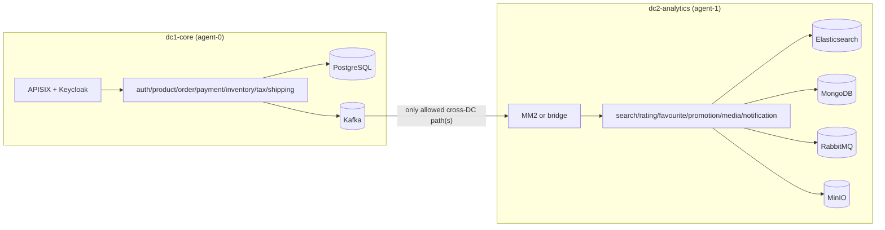

# Architecture (target — not yet built)

Everything below is the **intended** end state. Only Phase 0 scaffolding exists in the repo.

| Phase | Adds |
|-------|------|
| 1 | Namespaces, ResourceQuotas, NetworkPolicies (default-deny plus explicit replication paths), node labels and taints |
| 2 | Operators in `platform-operators`; PostgreSQL (CloudNativePG), single-node KRaft Kafka (Strimzi), Cassandra (cass-operator) in `dc1-core` |
| 3 | DC1 services (charts/spring-service), APISIX standalone, Keycloak (keycloakx), Debezium CDC on orders; end-to-end order test |
| 4 | DC2: kafka-dc2 + MirrorMaker 2 (identity), connect-dc2 sinks (MongoDB, RabbitMQ), Elasticsearch (ECK), MongoDB (mongodb-kubernetes), RabbitMQ (Cluster + Topology Operators), RustFS, pg-dc2, Mailpit, six services; product CDC + Cassandra sink in DC1; cert-manager |
| 5 | CI server and pipeline → k3d registry → Helm release |
| 6 | kube-prometheus-stack + monitors/rules (charts/observability) + exporters, dashboards (monitoring/grafana-dashboards), Fluent Bit → ECK Elasticsearch/Kibana, Icinga (charts/icinga) with Alertmanager/Icinga mail to Mailpit |
| 7 | Chaos Mesh; experiments: Kafka broker kill, PostgreSQL primary failover (2 instances), DC1↔DC2 partition, cross-DC latency; scripts/chaos-demo.sh reports degradation, recovery and downstream consistency |

Open questions that affect this design are listed in `docs/upstream-app-findings.md`.
